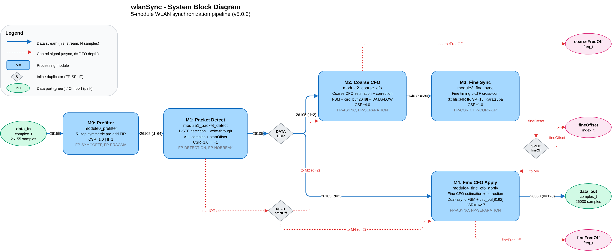
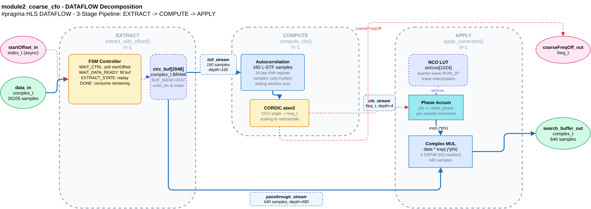
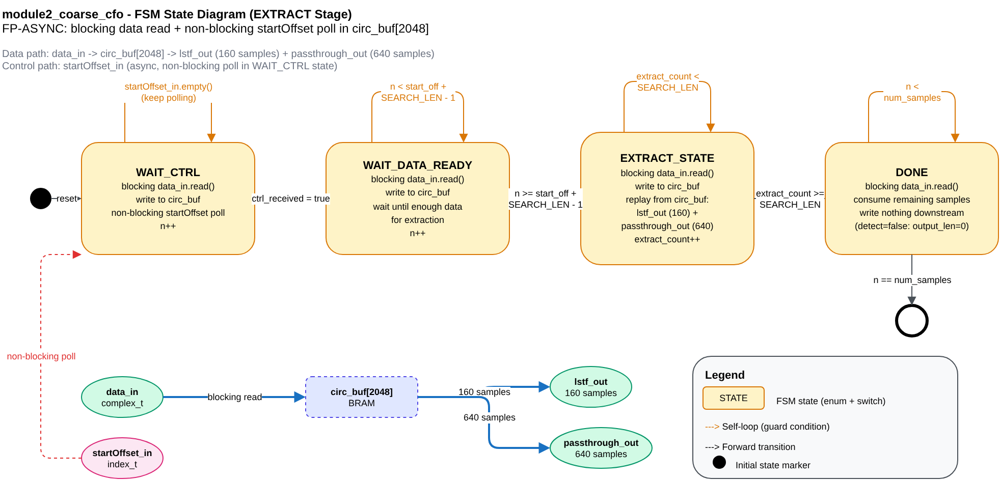
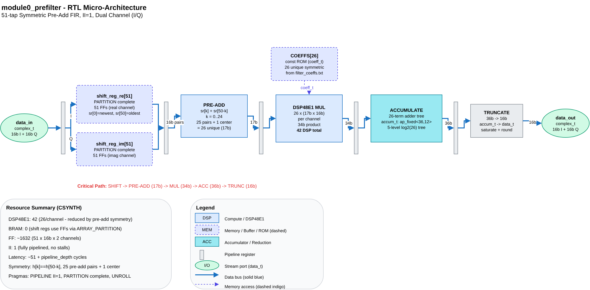
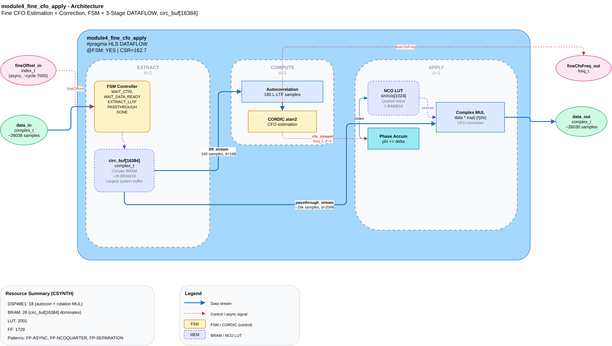

# Claude Draw.io Plugin

Claude Code plugin for generating Draw.io XML diagrams for FPGA/HLS architecture designs. Produces `.drawio` files with companion `.arch.json` machine-readable summaries.

## Features

- **4 diagram types**: System topology, DATAFLOW decomposition, FSM state diagrams, RTL micro-architecture
- **FPGA component library**: 20+ copy-paste XML snippets for DSP48, BRAM, shift registers, FIR IP, CORDIC, FSM, pipeline registers, and more
- **Semantic color palette**: Consistent fill/stroke pairs for DSP (blue), memory (indigo), control (amber), I/O (green/pink)
- **Machine-readable companions**: Every `.drawio` gets a `.arch.json` (~500 tokens) for agent consumption
- **CLI PNG rendering**: Headless export via draw.io AppImage + xvfb-run
- **3-4x more token-efficient** than Excalidraw for equivalent diagrams

## Installation

```bash
cd ~/.claude/plugins
git clone https://github.com/rockyco/claude-drawio-plugin.git drawio
```

The `drawio` skill will be auto-discovered by Claude Code on next session start.

## Usage

The skill triggers automatically when you ask Claude Code to create diagrams, flowcharts, architecture diagrams, RTL micro-architecture, FSM state diagrams, DATAFLOW decomposition, or system topology.

```
# Examples of natural language triggers:
"Create a system block diagram for the wlanSync pipeline"
"Generate an FSM state diagram for module2's async control consumer"
"Draw the RTL micro-architecture for the FIR filter datapath"
"Show the DATAFLOW decomposition with EXTRACT/COMPUTE/APPLY stages"
```

## PNG Rendering

Render `.drawio` files to PNG using the draw.io desktop AppImage:

```bash
# One-time download (no sudo needed):
curl -sL -o /tmp/drawio.AppImage \
  "https://github.com/jgraph/drawio-desktop/releases/download/v29.5.1/drawio-x86_64-29.5.1.AppImage"
chmod +x /tmp/drawio.AppImage

# Render a single diagram (2x scale for crisp output):
xvfb-run -a /tmp/drawio.AppImage --no-sandbox --export --format png --scale 2 \
  -o output.png input.drawio
```

## Diagram Types

### System Block Diagram

Module topology with data/control streams, splitters, and FIFO depths.



### DATAFLOW Decomposition

Internal DATAFLOW stages (EXTRACT/COMPUTE/APPLY) with FSM and circular buffers.



### FSM State Diagram

Finite state machine transitions with self-loops and guard conditions.



### RTL Micro-Architecture

Detailed datapath with DSP48, BRAM, pipeline registers, and bit-width annotations.



### Module Architecture

High-level module architecture showing internal blocks and data flow.



## Draw.io vs Excalidraw

| Criterion | Draw.io | Excalidraw |
|-----------|---------|------------|
| Tokens/element | ~30-50 | ~80-120 |
| Text centering | Automatic | Manual formula |
| RTL microarch | Same XML format | Separate SVG |
| Arrow routing | Built-in orthogonal | Manual points |
| AI generation errors | Style typos (low severity) | Binding mismatches (high severity) |
| Editing | Desktop + VSCode + web | Web only |

For detailed comparison with empirical data, see [references/comparison.md](skills/drawio/references/comparison.md).

## Plugin Structure

```
claude-drawio-plugin/
  .claude-plugin/plugin.json    # Plugin manifest
  skills/drawio/
    SKILL.md                    # Main skill (auto-triggered)
    references/
      element-reference.md      # Complete mxCell property reference
      best-practices.md         # Layout guidelines, FPGA conventions
      fpga-shapes.md            # 20+ FPGA component XML snippets
      comparison.md             # Draw.io vs Excalidraw empirical data
      examples.md               # 4 complete working diagrams
  templates/
    fpga-library.xml            # Importable draw.io custom shape library
  examples/wlanSync/            # 17 real-world FPGA diagrams (51 files)
```

## Examples

The `examples/wlanSync/` directory contains 17 production diagrams from a WLAN synchronization FPGA design across 5 HLS modules. Each diagram includes:

- `.drawio` - Editable XML source
- `.arch.json` - Machine-readable architecture summary
- `.png` - Pre-rendered PNG (2x scale)

| Module | Diagrams |
|--------|----------|
| System | system_block_diagram, system_integration |
| M0: Prefilter | architecture, microarch |
| M1: Packet Detect | architecture, microarch |
| M2: Coarse CFO | architecture, dataflow, fsm, microarch |
| M3: Fine Sync | architecture, dataflow, microarch |
| M4: Fine CFO Apply | architecture, dataflow, fsm, microarch |

## License

MIT
